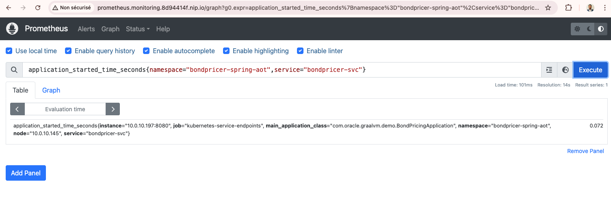
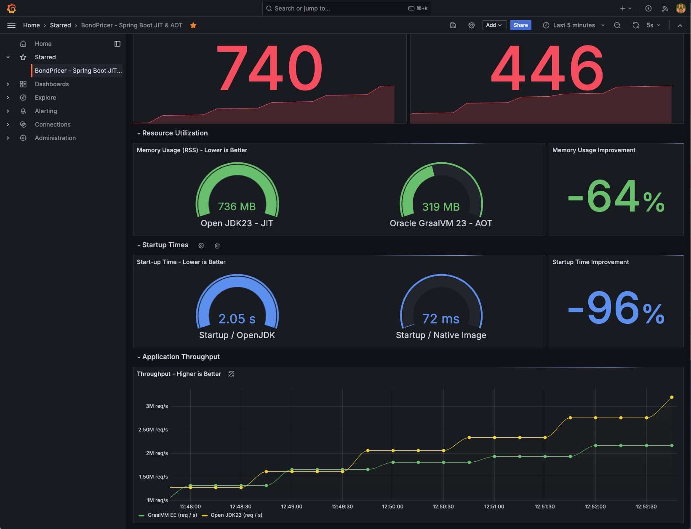

# GraalVM 101 - Spring Boot 
GraalVM 101: <i>Practical Workshop to Get Started with Orcle GraalVM  .</i>


<b> Table of Contents</b>

 1. [Install GraalVM EE](#installing-graalvm-ee)
 2. [Creating a simple Spring Boot Bond Princing API](#bond-pricing-spring-boot-api)
 3. [GraalVM JIT to boost Throughputs](#performance-boot-with-graalvm-jit-compiler)
 4. [GraalVM Native Image : Faster,Leaner ](#performance-boot-with-graalvm-nativeimage)
 5. [Cloud Native Deployments with GraalVM Native Image](#cloud-native-devployment)
 6. [Bond Pricing: Micronaut version](./02-micronaut/README.md)

# Tooling and requirements

- Java Runtimes: GraalVM + OpenJDK
- [Apache benchmark](https://httpd.apache.org/docs/2.4/programs/ab.html)
- [hey](https://github.com/rakyll/hey)
- [Maven](https://maven.apache.org/)
- [upx](https://github.com/upx/upx/releases)
- [Docker/Podman](https://docs.docker.com/engine/)

## Installing GraalVM EE

Use the following docs/links to install Oracle GraalVM for JDK 23

* [GraalVM Installation instructions](https://docs.oracle.com/en/graalvm/)


## Bond Pricing Spring Boot API

A [Bond](<https://www.investopedia.com/terms/b/bond.asp>) is a financial instrument that represent a loan made by an investor to a borrower that pays investor a fixed rate of return over a specific timeframe(Maturity).
At the end of the maturity period the Principal amount is paid back to the investor. 


In this section, you will have to create a  Bond Pricing SpringBoot API that compute the selling price of a bond using the [Present Value Model](https://en.wikipedia.org/wiki/Bond_valuation#Present_value_approach) with


Where: 
* `PV` is the Selling price/Fair Value to compute 
* `C` is a coupon, periodic interest received by the lender.
`C = Contractual  * Face Value of the bond `
* `r` is the market yield to maturity
* `T` represents the number of payment to received/ years( Maturity Term)
* [More about the formular](https://www.simtrade.fr/blog_simtrade/how-compute-present-value-asset/)

1. Use spring [initialzr](https://start.spring.io/) to create the following project


2. Keep the default selected items
Language: <b>Java</b><br>
Project: <b>Maven</b><br>
Spring Boot: <b>3.4.2</b><br>

3. Fill the form with the following details.
Group: <b>com.oracle.graalvm.demo</b><br>
Artifact: <b>BondPricing</b><br>
Description : <b>Bond Pricing Demo Project for GraalVM & Spring Boot</b><br>
Package Name: <b>com.oracle.graalvm.demo</b><br>
Packaging: <b>Jar</b><br>
Java:  <b>23</b><br>  <i>Pick the java version that suits your needs</i>

4. Add the following dependencies
- GraalVM Native Support
- Spring Web
- Prometheus
- Spring Boot Actuator

5. Download the project, unzip it and open the directory in your favorite code editor. or use the shared [configuration provided](https://start.spring.io/#!type=maven-project&language=java&platformVersion=3.4.2&packaging=jar&jvmVersion=23&groupId=com.oracle.graalvm.demo&artifactId=BondPricing&name=BondPricing&description=Bond%20Pricing%20Demo%20Project%20for%20GraalVM%20%26%20Spring%20Boot&packageName=com.oracle.graalvm.demo&dependencies=native,prometheus,web,actuator) to replicate

6. Add a `com.oracle.graalvm.demo.PricerController` class as describeb below.

- The conroller has two endpoints
- `/` return a welcome text
- `/price/{name}/{principal}/{maturity}?yield=xx&interestRate=y` used to compute the bond fair price

```java
package com.oracle.graalvm.demo;

import org.springframework.http.ResponseEntity;
import org.springframework.web.bind.annotation.*;

import java.util.stream.Stream;

@RestController
public class PriceController {

 @GetMapping("/")
 public String index() {
  return "Welcome to GraalVM Spring Boot HOL!\n";
 }

 /**
  * @param name : Bond name
  * @param interestRate  : Contractual Interest Rate
  * @param principal : the bond PAR/FACE Value or principal ( amount returned to the bond acquirer at the maturity)
  * @param maturity : Number of years/coupon for the bond to mature: For simplicity we stick on annual payments
  * @param yield : Market Interest rate / appropriate yield to maturity
  * @see  <a href="https://en.wikipedia.org/wiki/Bond_valuation#Present_value_approach"></a>
  * @return The Bond Selling price
  */
 @GetMapping("/price/{name}/{principal}/{maturity}")
  public ResponseEntity<String>  price (
   @PathVariable(name = "name") String name,
   @PathVariable(value ="principal" , required = true ) double principal,
   @PathVariable(value = "maturity", required = true) int maturity,
   @RequestParam(value = "yield", required = true ) double yield,
   @RequestParam( name="interestRate",required = true ) double interestRate
 )

 {

  Double bondMarketPrice=
    Stream.iterate(1, year -> year +1)
    .limit(maturity)
    .parallel()
    .mapToDouble(t -> interestRate*principal/Math.pow(1+yield,t)) // compute coupon (interest) stream
    .sum() ;

  bondMarketPrice += principal/Math.pow(1+yield,maturity);

  return ResponseEntity.ok().body(String.format("%.3f\n",bondMarketPrice));
 }

}

```

7. Upate the Test Case

```java
@SpringBootTest(webEnvironment = SpringBootTest.WebEnvironment.RANDOM_PORT)
public class PriceControllerTest {

    @Autowired
    private TestRestTemplate template;
    ...

    @Test
    public void getPrice() throws Exception {
         ResponseEntity<String> response = template.getForEntity("/price/GRAALVM_PREMIUM_BOND/100/1?yield=0.01&interestRate=0.05", String.class);
        assertThat(response.getBody().toString().contains("103.960"));
    }

```

8. In oder to produce  metrics for premetheus, use the following configuration
```sh
cat src/main/application.properties

spring.application.name=BondPricing
management.endpoints.web.exposure.include=health,info,liveness,readiness,metrics,prometheus
management.endpoint.metrics.enabled=true
management.health.livenessState.enabled=true
management.health.readinessState.enabled=true
```


9. Use Oracle GraalVM  23+ as your Java Runtime 
various options available:
- export JAVA_HOME=..
- `sdk use java 23-graal`

```sh 
$ $ java -version
❯ java -version
java version "23" 2024-09-17
Java(TM) SE Runtime Environment Oracle GraalVM 23+37.1 (build 23+37-jvmci-b01)
Java HotSpot(TM) 64-Bit Server VM Oracle GraalVM 23+37.1 (build 23+37-jvmci-b01, mixed mode, sharing)
```

10- Build the Application and get a couple of fair prices using Maven/Gradle
```sh
$ mvn clean package 
...
ar
[INFO]
[INFO] --- spring-boot:3.4.2:repackage (repackage) @ BondPricing ---
[INFO] Replacing main artifact /Users/enono/Workspace/Java/...lab/GraalVM101/01-springboot/BondPricing/target/BondPricing-0.0.1-SNAPSHOT.jar with repackaged archive, adding nested dependencies in BOOT-INF/.
[INFO] The original artifact has been renamed to /Users/enono/Workspace/Java/.../lab/GraalVM101/01-springboot/BondPricing/target/BondPricing-0.0.1-SNAPSHOT.jar.original
[INFO] ------------------------------------------------------------------------
[INFO] BUILD SUCCESS
[INFO] ------------------------------------------------------------------------
[INFO] Total time:  3.310 s
[INFO] Finished at: 2025-02-13T10:46:05+01:00
[INFO] ------------------------------------------------------------------------
```
the `BondPricing-0.0.1-SNAPSHOT.jar` is  generates and can be started using 

```sh
$ java -jar target/BondPricing-0.0.1-SNAPSHOT.jar
 .   ____          _            __ _ _
 /\\ / ___'_ __ _ _(_)_ __  __ _ \ \ \ \
( ( )\___ | '_ | '_| | '_ \/ _` | \ \ \ \
 \\/  ___)| |_)| | | | | || (_| |  ) ) ) )
  '  |____| .__|_| |_|_| |_\__, | / / / /
 =========|_|==============|___/=/_/_/_/

 :: Spring Boot ::                (v3.4.2)

2025-02-13T10:48:03.037+01:00  INFO 59585 --- [BondPricing] [           main] c.o.graalvm.demo.BondPricingApplication  : Starting BondPricingApplication v0.0.1-SNAPSHOT using Java 23 with PID 59585 (/Users/enono/Workspace/Java/lab/GraalVM101/01-springboot/BondPricing/target/BondPricing-0.0.1-SNAPSHOT.jar started by enono in /Users/enono/Workspace/Java//lab/GraalVM101/01-springboot/BondPricing)
2025-02-13T10:48:03.039+01:00  INFO 59585 --- [BondPricing] [           main] c.o.graalvm.demo.BondPricingApplication  : No active profile set, falling back to 1 default profile: "default"
...
8080 (http) with context path '/'
2025-02-13T10:48:03.719+01:00  INFO 59585 --- [BondPricing] [           main] c.o.graalvm.demo.BondPricingApplication  : Started BondPricingApplication in 0.836 seconds (process running for 1.069)
```
the application starts in <b>0.836 seconds.</b>


10- Compute a couple of bond Fair Values 
```sh
$ curl  'http://localhost:8080/price/graalvm-premium-bond/100/1?yield=0.01&interestRate=0.05'
103,960

$ curl  'http://localhost:8080/price/graalvm-discount_bond/100/1?yield=0.06&interestRate=0.05'
99,057
```
That concludes the first part. The second part will focus on benchmarking the application's performance using various Java runtimes.


## Performance Boost with GraalVM JIT Compiler
### GraalVM JIT
In the following section, we start the BondPricer with GraalVM JIT and then send 10,000 pricing requests with a concurrency level factor of 100. The load is generated using Apache Benchmark."

We limit the application to use maximum 20% of the available CPU

 ```sh
$sdk use java 23-graal
$ cpulimit -l 20  java -jar target/BondPricing-0.0.1-SNAPSHOT.jar
2025-02-13T11:48:33.850+01:00  INFO 65633 --- [BondPricing] [           main] c.o.graalvm.demo.BondPricingApplication  : Started BondPricingApplication in 0.884 seconds (process running for 1.119)
```
The application starts with pid=65633

Use the pid provided to track cpu and memory usage 
```sh
top -pid 65633
PID    COMMAND      %CPU  TIME     #TH    #WQ  #POR MEM   PURG CMPR PGRP  PPID  STATE    BOOSTS    %CPU_ME %CPU_OTHRS UID  FAULTS COW   MSGSEN
65633  java         0.1   00:12.19 45     1    175  411M  0B   0B   65632 65632 sleeping *0[1]     0.00000 0.00000    503  74271  4939  45070+
```


```sh 
❯ ab -n 10000 -c 100  'http://localhost:8080/price/graalvm/100/20?yield=0.01&interestRate=0.05'
ab -n 10000 -c 100  'http://localhost:8080/price/graalvm/100/20?yield=0.01&interestRate=0.05'
This is ApacheBench, Version 2.3 <$Revision: 1913912 $>
Copyright 1996 Adam Twiss, Zeus Technology Ltd, http://www.zeustech.net/
Licensed to The Apache Software Foundation, http://www.apache.org/

Benchmarking localhost (be patient)
Completed 1000 requests
Completed 2000 requests
Completed 3000 requests
Completed 4000 requests
Completed 5000 requests
Completed 6000 requests
Completed 7000 requests
Completed 8000 requests
Completed 9000 requests
Completed 10000 requests
Finished 10000 requests


Server Software:
Server Hostname:        localhost
Server Port:            8080

Document Path:          /price/graalvm/100/20?yield=0.01&interestRate=0.05
Document Length:        8 bytes

Concurrency Level:      100
Time taken for tests:   0.708 seconds
Complete requests:      10000
Failed requests:        0
Total transferred:      1400000 bytes
HTML transferred:       80000 bytes
Requests per second:    14131.36 [#/sec] (mean)
Time per request:       7.076 [ms] (mean)
Time per request:       0.071 [ms] (mean, across all concurrent requests)
Transfer rate:          1932.02 [Kbytes/sec] received

Connection Times (ms)
              min  mean[+/-sd] median   max
Connect:        0    3   0.8      3      11
Processing:     1    4   1.2      4      14
Waiting:        1    4   1.1      3      14
Total:          2    7   1.4      7      17

Percentage of the requests served within a certain time (ms)
  50%      7
  66%      7
  75%      7
  80%      7
  90%      8
  95%      9
  98%     13
  99%     14
 100%     17 (longest request)
 ```


### Non GraalVM Java JIT Compiler

In the following section we restart the BondPricer with a default JIT compiler, and  send the same load( 10000 pricing  requests)  with Apache Benchmark and capture the performance Metrics.
use the `-XX:-UseJVMCICompiler` JVM option to fall back of the default JIT compiler or restart your application with an openJDK 23 for eg.

```sh
sdk use java 23-open
```


```sh
$ cpulimit -l 20  java -XX:+UnlockExperimentalVMOptions -XX:-UseJVMCICompiler -jar target/BondPricing-0.0.1-SNAPSHOT.jar

Started BondPricingApplication in 0.958 seconds (process running for 1.292)
```
Benchmark - C2 compiler
```sh
$ ab -n 10000 -c 100  'http://localhost:8080/price/graalvm/100/20?yield=0.01&interestRate=0.05'
This is ApacheBench, Version 2.3 <$Revision: 1913912 $>
Copyright 1996 Adam Twiss, Zeus Technology Ltd, http://www.zeustech.net/
Licensed to The Apache Software Foundation, http://www.apache.org/

Benchmarking localhost (be patient)
Completed 1000 requests
Completed 2000 requests
Completed 3000 requests
Completed 4000 requests
Completed 5000 requests
Completed 6000 requests
Completed 7000 requests
Completed 8000 requests
Completed 9000 requests
Completed 10000 requests
Finished 10000 requests


Server Software:
Server Hostname:        localhost
Server Port:            8080

Document Path:          /price/graalvm/100/20?yield=0.01&interestRate=0.05
Document Length:        8 bytes

Concurrency Level:      100
Time taken for tests:   1.396 seconds
Complete requests:      10000
Failed requests:        0
Total transferred:      1400000 bytes
HTML transferred:       80000 bytes
Requests per second:    7162.87 [#/sec] (mean)
Time per request:       13.961 [ms] (mean)
Time per request:       0.140 [ms] (mean, across all concurrent requests)
Transfer rate:          979.30 [Kbytes/sec] received

Connection Times (ms)
              min  mean[+/-sd] median   max
Connect:        0    1   1.6      0      24
Processing:     1   12  11.4     10     208
Waiting:        1   12  11.1      9     206
Total:          1   13  11.6     10     213

Percentage of the requests served within a certain time (ms)
  50%     10
  66%     11
  75%     12
  80%     14
  90%     22
  95%     36
  98%     49
  99%     58
 100%    213 (longest request)

```
Benchmark with Amazon Correto

```sh
sdk use java 23.0.2-amzn
Using java version 23.0.2-amzn in this shell.
```

```sh
$ cpulimit -l 20  java -XX:+UnlockExperimentalVMOptions -XX:-UseJVMCICompiler -jar target/BondPricing-0.0.1-SNAPSHOT.jar
```


```sh 
ab -n 10000 -c 100  'http://localhost:8080/price/graalvm/100/20?yield=0.01&interestRate=0.05'
This is ApacheBench, Version 2.3 <$Revision: 1913912 $>
Copyright 1996 Adam Twiss, Zeus Technology Ltd, http://www.zeustech.net/
Licensed to The Apache Software Foundation, http://www.apache.org/

Benchmarking localhost (be patient)
Completed 1000 requests
Completed 2000 requests
Completed 3000 requests
Completed 4000 requests
Completed 5000 requests
Completed 6000 requests
Completed 7000 requests
Completed 8000 requests
Completed 9000 requests
Completed 10000 requests
Finished 10000 requests


Server Software:
Server Hostname:        localhost
Server Port:            8080

Document Path:          /price/graalvm/100/20?yield=0.01&interestRate=0.05
Document Length:        8 bytes

Concurrency Level:      100
Time taken for tests:   2.449 seconds
Complete requests:      10000
Failed requests:        0
Total transferred:      1400000 bytes
HTML transferred:       80000 bytes
Requests per second:    4082.73 [#/sec] (mean)
Time per request:       24.493 [ms] (mean)
Time per request:       0.245 [ms] (mean, across all concurrent requests)
Transfer rate:          558.19 [Kbytes/sec] received

Connection Times (ms)
              min  mean[+/-sd] median   max
Connect:        0    1   2.8      0      22
Processing:     1   22  13.3     20     173
Waiting:        1   22  12.8     20     165
Total:          2   24  12.9     21     173

Percentage of the requests served within a certain time (ms)
  50%     21
  66%     23
  75%     26
  80%     28
  90%     35
  95%     42
  98%     62
  99%     90
 100%    173 (longest request)
```

GraalVM outperformes both openjdk and Correto JIT for this use case.

|  JIT Performance |<i>Req/sec   |  Time per Req(mean)ms | Overall time (s)  |   |
|---|---|---|---|---|
|   GraalVM 23+37.1  | <b><span style="color:green">14131.36</span></b>  | <b><span style="color:green">7.076</span>  | <b><span style="color:green">0.708</span> </b> |
|  Coretto Corretto-23.0.2.7.1 |4082.73   | 24.93  | 2.45  |
|  Open JDK build 23+37-2369 |   7162.87 |  13.961 |   1.396|

Observations for BondPricing App.
GraalVM JIT outperformed both Corretto and OpenJDK, handling nearly 3.5x more requests per second than Corretto.
OpenJDK performed ~75% better than Corretto but still lagged behind GraalVM.
The mean request time for GraalVM was significantly lower, making it the most efficient option in this test.


## Performance Boost with GraalVM Native Image

### Native Image Build
To build the native image associated to the application use the command

First update (optional) the native-maven-plugin plugin configuration 

```xml
<plugin>
                <groupId>org.graalvm.buildtools</groupId>
                <artifactId>native-maven-plugin</artifactId>
                <configuration>
                    <imageName>BondPricingApp</imageName>
                    <buildArgs>
                        <buildArg>-H:+ReportExceptionStackTraces </buildArg>
                        <buildArg>-Os</buildArg>
                    </buildArgs>
                </configuration>
            </plugin>
```


```sh 
$  mvn clean package native:compile -Pnative -DskipTests

....
 PGO:  Use Profile-Guided Optimizations ('--pgo') for improved throughput.
 HEAP: Set max heap for improved and more predictable memory usage.
 QBM:  Use the quick build mode ('-Ob') to speed up builds during development.
------------------------------------------------------------------------------------------------------------------------
                       4,4s (8,3% of total time) in 1165 GCs | Peak RSS: 2,93GB | CPU load: 7,41
------------------------------------------------------------------------------------------------------------------------
Build artifacts:
 /Users/enono/Workspace/Java/lab/GraalVM101/01-springboot/BondPricing/target/BondPricingApp (executable)
========================================================================================================================
Finished generating 'BondPricingApp' in 52,4s.
[INFO] ------------------------------------------------------------------------
[INFO] BUILD SUCCESS
[INFO] ------------------------------------------------------------------------
[INFO] Total time:  58.178 s
[INFO] Finished at: 2025-02-17T14:53:44+01:00

```

A native `BondPricingApp` image file is generated
```sh
$ ls -rtlh target/
total 170728
drwxr-xr-x@ 3 enono  staff    96B 17 fév 14:52 graalvm-reachability-metadata
drwxr-xr-x@ 3 enono  staff    96B 17 fév 14:52 maven-status
drwxr-xr-x@ 3 enono  staff    96B 17 fév 14:52 generated-sources
drwxr-xr-x@ 3 enono  staff    96B 17 fév 14:52 test-classes
drwxr-xr-x@ 3 enono  staff    96B 17 fév 14:52 spring-aot
drwxr-xr-x@ 6 enono  staff   192B 17 fév 14:52 classes
drwxr-xr-x@ 3 enono  staff    96B 17 fév 14:52 maven-archiver
drwxr-xr-x@ 3 enono  staff    96B 17 fév 14:52 generated-test-sources
-rw-r--r--@ 1 enono  staff   242K 17 fév 14:52 BondPricing-0.0.1-SNAPSHOT.jar.original
-rw-r--r--@ 1 enono  staff    25M 17 fév 14:52 BondPricing-0.0.1-SNAPSHOT.jar
-rwxr-xr-x@ 1 enono  staff    58M 17 fév 14:53 BondPricingApp
```
### Fast startup 

```sh 
$ cpulimit -l 20   ./target/BondPricingApp
h context path '/'
2025-02-17T14:55:52.374+01:00  INFO 77573 --- [BondPricing] [           main] c.o.graalvm.demo.BondPricingApplication  : Started BondPricingApplication in 0.053 seconds (process running for 0.074)
```
The native image build starts very fast <b><span style="color:green">0.053</span></b> compared to <span style="color:orange">0.836 seconds </span>2 in tthe [JIT mode](#graalvm-jit)


## Cloud Native Devployment
 

### The Old way

Connect to Oracle Container registry 
```sh
$ podman login container-registry.oracle.com -u $OCR_USER  -p $OCR_TOKEN
```

Connect to Github Container Registry 
```sh
$ podman login ghcr.io -u $GHCR_USER  -p $GHCR_TOKEN
sh 


#### Build a JIT container
```sh 
$ cd BondPricing
$ docker build -f docker/Dockerfile.jit.ol8.openjdk23 -t  ghcr.io/nelvadas/bondpricing:2.0.0-spring-jit-openjdk23  .
```
Image size 

```sh 
❯ docker images | grep bondpricing
ghcr.io/nelvadas/bondpricing                         2.0.0-spring-jit-openjdk23   922a6123843a  4 hours ago    559 MB
```
Application up and Running 

```sh 
$ docker run -p 7070:8080 -d ghcr.io/nelvadas/bondpricing:2.0.0-spring-jit-openjdk23
❯ docker ps
CONTAINER ID  IMAGE                                                    COMMAND            CREATED      STATUS      PORTS                             NAMES
97be841d16cb  ghcr.io/nelvadas/bondpricing:2.0.0-spring-jit-openjdk23  java -jar app.jar  4 hours ago  Up 4 hours  0.0.0.0:7070->8080/tcp, 8080/tcp  boring_burnell
```
#### Check the metrics published by the application 

```sh 
~ via 🐍 v3.12.4 on ☁️  (us-east-2)
❯ curl http://localhost:7070/actuator/prometheus
# HELP application_ready_time_seconds Time taken for the application to be ready to service requests
# TYPE application_ready_time_seconds gauge
application_ready_time_seconds{main_application_class="com.oracle.graalvm.demo.BondPricingApplication"} 0.962
# HELP application_started_time_seconds Time taken to start the application
# TYPE application_started_time_seconds gauge
....
# TYPE tomcat_sessions_created_sessions_total counter
tomcat_sessions_created_sessions_total 0.0
# HELP tomcat_sessions_expired_sessions_total
# TYPE tomcat_sessions_expired_sessions_total counter
tomcat_sessions_expired_sessions_total 0.0
# HELP tomcat_sessions_rejected_sessions_total
# TYPE tomcat_sessions_rejected_sessions_total counter
tomcat_sessions_rejected_sessions_total 0.0
```


### Natime image patterns
On a Linux Workstation , Build the native image using 

```sh
mvn clean package native:compile -Pnative -DskipTests


 - Use '--enable-sbom' to assemble a Software Bill of Materials (SBOM).
------------------------------------------------------------------------------------------------------------------------
Recommendations:
 G1GC: Use the G1 GC ('--gc=G1') for improved latency and throughput.
 PGO:  Use Profile-Guided Optimizations ('--pgo') for improved throughput.
 HEAP: Set max heap for improved and more predictable memory usage.
 CPU:  Enable more CPU features with '-march=native' for improved performance.
 QBM:  Use the quick build mode ('-Ob') to speed up builds during development.
------------------------------------------------------------------------------------------------------------------------
                       37.9s (8.4% of total time) in 2368 GCs | Peak RSS: 3.16GB | CPU load: 0.96
------------------------------------------------------------------------------------------------------------------------
Build artifacts:
 /home/opc/GraalVM101/01-springboot/BondPricing/target/BondPricingApp (executable)
========================================================================================================================
Finished generating 'BondPricingApp' in 7m 28s.
[INFO] ------------------------------------------------------------------------
[INFO] BUILD SUCCESS
[INFO] ------------------------------------------------------------------------
[INFO] Total time:  07:54 min
[INFO] Finished at: 2025-02-18T10:19:40Z
[INFO] ------------------------------------------------------------------------
[opc@enono-bastion BondPricing]$

```


#### Optimizing package size
Package size can be optimized using upx 


```sh
$curl --location --output upx-4.2.4-amd64_linux.tar.xz "https://github.com/upx/upx/releases/download/v4.2.4/upx-4.2.4-amd64_linux.tar.xz"
$tar -xJf upx-4.2.4-amd64_linux.tar.xz
$sudo mv upx-4.2.4-amd64_linux/upx /bin/upx
```

Check the current binary size 

```sh
[opc@enono-bastion BondPricing]$ ls -rtlh ./target/
total 80M
drwxrwxr-x. 3 opc opc   54 Feb 18 10:11 graalvm-reachability-metadata
drwxrwxr-x. 3 opc opc   35 Feb 18 10:11 maven-status
drwxrwxr-x. 3 opc opc   25 Feb 18 10:11 generated-sources
drwxrwxr-x. 3 opc opc   17 Feb 18 10:11 test-classes
drwxrwxr-x. 3 opc opc   18 Feb 18 10:11 spring-aot
drwxrwxr-x. 5 opc opc   74 Feb 18 10:11 classes
drwxrwxr-x. 2 opc opc   28 Feb 18 10:12 maven-archiver
drwxrwxr-x. 3 opc opc   30 Feb 18 10:12 generated-test-sources
-rw-rw-r--. 1 opc opc 242K Feb 18 10:12 BondPricing-0.0.1-SNAPSHOT.jar.original
-rw-rw-r--. 1 opc opc  25M Feb 18 10:12 BondPricing-0.0.1-SNAPSHOT.jar
-rwxrwxr-x. 1 opc opc  55M Feb 18 10:19 BondPricingApp
```

Reduce the package size with upx util

```sh 
[opc@enono-bastion BondPricing]$ upx -o ./target/BondPricingApp.upx ./target/BondPricingApp
                       Ultimate Packer for eXecutables
                          Copyright (C) 1996 - 2024
UPX 4.2.4       Markus Oberhumer, Laszlo Molnar & John Reiser    May 9th 2024

        File size         Ratio      Format      Name
   --------------------   ------   -----------   -----------
  57219152 ->  20351316   35.57%   linux/amd64   BondPricingApp.upx

Packed 1 file.
```
Native image reduce from <b>55M</b> to <b>20M</b>

```sh
[opc@enono-bastion BondPricing]$ ls -rtlh ./target/BondPricingApp*
-rwxrwxr-x. 1 opc opc 20M Feb 18 10:19 ./target/BondPricingApp.upx
-rwxrwxr-x. 1 opc opc 55M Feb 18 10:19 ./target/BondPricingApp
```


### Embark the compressed native image in the container
Build a new docker image

```sh
$ podman build -f docker/Dockerfile.native.basic -t ghcr.io/nelvadas/bondpricing:2.0.0-spring-aot-graal23-x86_64 .
TEP 1/4: FROM docker.io/oraclelinux:8-slim
STEP 2/4: EXPOSE 8080
--> Using cache e6e49b6bd521685f7e8c8e210354394f48912dcd084f470e5fdd07219c659363
--> e6e49b6bd521
STEP 3/4: COPY ../target/BondPricingApp.upx /app
--> 24ad54e856e3
STEP 4/4: ENTRYPOINT ["/app"]
COMMIT ghcr.io/nelvadas/bondpricing:2.0.0-spring-aot-graal23-x86_64
--> 3031073aef68
Successfully tagged ghcr.io/nelvadas/bondpricing:2.0.0-spring-aot-graal23-x86_64
3031073aef68d8f8a466de46a5db75b3cd923dfe18f1f3964263548cc5566add
```

Run a container built on top of Native Image executable 

```sh 
[opc@enono-workstation-01 BondPricing]$ podman run -d -p 7070:8080 ghcr.io/nelvadas/bondpricing:2.0.0-spring-aot-graal23-x86_64
a719142924904a2d3eea280efb5be1b924d70993df8082a5bb7b6266b5820fca
```

Check logs 

```sh
[opc@enono-bastion BondPricing]$ podman logs a719

  .   ____          _            __ _ _
 /\\ / ___'_ __ _ _(_)_ __  __ _ \ \ \ \
( ( )\___ | '_ | '_| | '_ \/ _` | \ \ \ \
 \\/  ___)| |_)| | | | | || (_| |  ) ) ) )
  '  |____| .__|_| |_|_| |_\__, | / / / /
 =========|_|==============|___/=/_/_/_/

 :: Spring Boot ::                (v3.4.2)

2025-02-18T10:36:00.846Z  INFO 1 --- [BondPricing] [           main] c.o.graalvm.demo.BondPricingApplication  : Starting AOT-processed BondPricingApplication using Java 23 with PID 1 (/app started by root in /)
2025-02-18T10:36:00.847Z  INFO 1 --- [BondPricing] [           main] c.o.graalvm.demo.BondPricingApplication  : No active profile set, falling back to 1 default profile: "default"
2025-02-18T10:36:00.857Z  INFO 1 --- [BondPricing] [           main] o.s.b.w.embedded.tomcat.TomcatWebServer  : Tomcat initialized with port 8080 (http)
2025-02-18T10:36:00.858Z  INFO 1 --- [BondPricing] [           main] o.apache.catalina.core.StandardService   : Starting service [Tomcat]
2025-02-18T10:36:00.858Z  INFO 1 --- [BondPricing] [           main] o.apache.catalina.core.StandardEngine    : Starting Servlet engine: [Apache Tomcat/10.1.34]
2025-02-18T10:36:00.864Z  INFO 1 --- [BondPricing] [           main] o.a.c.c.C.[Tomcat].[localhost].[/]       : Initializing Spring embedded WebApplicationContext
2025-02-18T10:36:00.864Z  INFO 1 --- [BondPricing] [           main] w.s.c.ServletWebServerApplicationContext : Root WebApplicationContext: initialization completed in 17 ms
2025-02-18T10:36:00.893Z  WARN 1 --- [BondPricing] [           main] i.m.c.i.binder.jvm.JvmGcMetrics          : GC notifications will not be available because no GarbageCollectorMXBean of the JVM provides any. GCs=[young generation scavenger, complete scavenger]
2025-02-18T10:36:00.896Z  INFO 1 --- [BondPricing] [           main] o.s.b.a.e.web.EndpointLinksResolver      : Exposing 4 endpoints beneath base path '/actuator'
2025-02-18T10:36:00.900Z  INFO 1 --- [BondPricing] [           main] o.s.b.w.embedded.tomcat.TomcatWebServer  : Tomcat started on port 8080 (http) with context path '/'d
2025-02-18T10:36:00.900Z  INFO 1 --- [BondPricing] [           main] c.o.graalvm.demo.BondPricingApplication  : Started BondPricingApplication in 0.063 seconds (process running for 0.066)
```
Application start very fast. <b>~ (0,066seco~d)</b>

The package size produced with the native image build is leaner

```sh 
[opc@enono-bastion BondPricing]$ docker images | grep bond
ghcr.io/nelvadas/bondpricing                        2.0.0-spring-aot-graal23-x86_64    3031073aef68  About a minute ago  138 MB
ghcr.io/nelvadas/bondpricing                        2.0.0-spring-jit-openjdk23-x86_64  66b3867916b4  3 days ago          548 MB
ghcr.io/nelvadas/bondpricing                        2.0.0-spring-jit-openjdk23         66b3867916b4  3 days ago          548 MB
```

The docker images are available as packages on the current repository 
```sh
docker pull ghcr.io/nelvadas/bondpricing:2.0.0-spring-jit-openjdk23-x86_64
docker pull ghcr.io/nelvadas/bondpricing:2.0.0-spring-aot-graal23-x86_64
```

### Graphana Live Metrics dashboard


#### Deploy a JIT container on Kubernetes
Access to a kubernetes cluster is required to complete the following part.

```sh
$ cd k8s
```
For AOT just run the following script that create various K8S resources 
Adjust the ingress to match your domain URL
```sh
BondPricing/k8s/spring-aot on  main [!?] on ☁️  (us-east-2)
❯ kubectl apply -f resources.yaml
namespace/bondpricer-spring-aot unchanged
deployment.apps/bondpricer unchanged
service/bondpricer-svc unchanged
ingress.networking.k8s.io/bondpricer-ing configured
```

Do the same in subfloder BondPricing/k8s/spring-jit to create the associated kubernetes resources.
```sh
BondPricing/k8s/spring-jit on  main [!?] on ☁️  (us-east-2)
❯ kubectl apply -f resources.yaml
namespace/bondpricer-spring-jit configured
deployment.apps/bondpricer configured
service/bondpricer-svc unchanged
ingress.networking.k8s.io/bondpricer-ing configured
```

```sh
❯ kubectl get po -n bondpricer-spring-jit
❯ kubectl get po -n bondpricer-spring-jit
NAME                          READY   STATUS    RESTARTS   AGE
bondpricer-6d7488765b-b6qqj   1/1     Running   0          11s

BondPricing/k8s/spring-jit on  main [!?] on ☁️  (us-east-2)
❯ kubectl get po -n bondpricer-spring-aot
NAME                          READY   STATUS    RESTARTS   AGE
bondpricer-5f65dc9bcd-qc4xw   1/1     Running   0          15m
```


#### Explore Metrics with Prometheus 

1. Check the startup times

using the  PROM QL expression 
```SQL
application_started_time_seconds{namespace="bondpricer-spring-aot",service="bondpricer-svc"}
```
2. All the metrics available in the namespace of your choice 
```SQL
{namespace="bondpricer-spring-jit"}
```
3. Memory usage 
```SQL
container_memory_usage_bytes{namespace="bondpricer-spring-jit",container="bondpricer"}
```

4. Avg memory usage by containers in a namespace 
avg(container_memory_usage_bytes{namespace="bondpricer-spring-aot",container="bondpricer"}


5.  Memory improvement

- RSS
```SQL
(sum(container_memory_rss{namespace="bondpricer-spring-jit"}) - sum(container_memory_rss{namespace="bondpricer-spring-aot"})) / sum(container_memory_rss{namespace="bondpricer-spring-jit"}) * -100
```

- Used Bytes
```SQL
(avg(container_memory_usage_bytes{namespace="bondpricer-spring-jit",container="bondpricer"})-
 avg(container_memory_usage_bytes{namespace="bondpricer-spring-aot",container="bondpricer"}))
 / (avg(container_memory_usage_bytes{namespace="bondpricer-spring-jit"container="bondpricer"})) * -100
```


6. Startup times improvements
```SQL
(sum(application_started_time_seconds{namespace="bondpricer-spring-jit"}) - sum(application_started_time_seconds{namespace="bondpricer-spring-aot"})) / sum(application_started_time_seconds{namespace="bondpricer-spring-jit"}) * -100
```


7. Throuputs 

```sh
hey -z 30m -c 1000 'http://bondpricer.spring.jit.8d94414f.nip.io/price/graalvm-discount_bond/100/3?yield=0.04&interestRate=0.05'
```

```sh
hey -z 30m -c 1000  'http://bondpricer.spring.aot.8d94414f.nip.io/price/graalvm-discount_bond/100/3?yield=0.04&interestRate=0.05'
```


#### Visualization with Graphana

The following grafana dashboard displays a couple of indicators extracted from Prometheus

 JSON dashboard available in [Grafana](./BondPricing/grafana/BondPricer%20-%20Spring%20Boot%20JIT%20&%20AOT-1739879914134.json)

# More Readings and Workshops

- [GraalVM HelloWorld](https://github.com/nelvadas/graalvm-helloworld-nativeimage)
- [GraalVM Native Image](https://github.com/nelvadas/Native-Image-Workshop)
- [GraalVM & Spring Boot Native Image Workshop](https://github.com/nelvadas/GraalVM-SpringBoot-Labs)
- [GraalVM Polyglot Workshop](https://github.com/nelvadas/GraalVM-Polyglot-Labs)
- [Accelerating Apache Spark with GraalVM](https://github.com/nelvadas/spark-with-graalvm)
- [GraalVM and Serverless](https://github.com/nelvadas/graalvm-serverless)
- [Accelerating Weblogic with GraalVM](https://github.com/nelvadas/graalvm-weblogic-jaxrs-demo)
