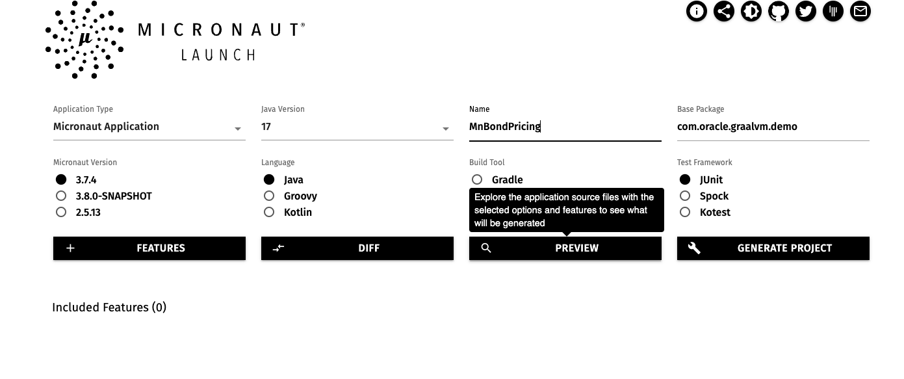

# GraalVM 101 - Micronaut

GraalVM 101: <i>Practical Workshop to Get Started with GraalVM Enterprise Edition and Micronaut Framework.</i>

<b> Table of Contents</b>

 1. [Install GraalVM EE](../README.md/#installing-graalvm-ee)
 2. [Creating a simple Spring Boot Bond Princing API](#bond-pricing-spring-boot-api)
 3. [GraalVM JIT to boost Throughputs](#performance-boot-with-graalvm-jit-compiler)
 4. [GraalVM Native Image : Faster,Leaner](#performance-boot-with-graalvm-nativeimage)
 5. [Cloud Native Deployments with GraalVM Native Image](#cloud-native-devployment)


# Tooling and requirements

- [sdk](https://sdkman.io/install)
- [micronaut 3.7.4+](https://micronaut.io/download/)
- [Apache benchmark](https://httpd.apache.org/docs/2.4/programs/ab.html)
- [hey](https://github.com/rakyll/hey)
- [Maven](https://maven.apache.org/)
- [upx](https://github.com/upx/upx/releases)
- [Docker/Podman](https://docs.docker.com/engine/)
- [kubectl](https://kubernetes.io/docs/reference/kubectl/)

## Installing GraalVM EE

Use the following docs/links to install GraalVM Enterprise 22.3+ for Java 17

- [GraalVM Installation instructions](https://docs.oracle.com/en/graalvm/enterprise/22/docs/getting-started/#install-graalvm-enterprise)
- [Oracle Linux /OCI](https://docs.oracle.com/en/graalvm/enterprise/22/docs/getting-started/#install-graalvm-enterprise)

## Bond Pricing Spring Boot API

A [Bond](<https://www.investopedia.com/terms/b/bond.asp>) is a financial instrument that represent a loan made by an investor to a borrower that pays investor a fixed rate of return over a specific timeframe(Maturity).
At the end of the maturity period the Principal amount is paid back to the investor.

In this section, you will have to create a  Bond Pricing SpringBoot API that compute the selling price of a bond using the [Present Value Model](https://en.wikipedia.org/wiki/Bond_valuation#Present_value_approach) with


Where:
- `PV` is the Selling price/Fair Value to compute
- `C` is a coupon, periodic interest received by the lender.
`C = Contractual  * Face Value of the bond`
- `r` is the market yield to maturity
- `T` represents the number of payment to received/ years( Maturity Term)
- [More about the formular](https://www.simtrade.fr/blog_simtrade/how-compute-present-value-asset/)

1. Use [Micronaut Launch](https://micronaut.io/launch/) to create the following project

Fill the form with the following details.
Application Type: <b>Micronaut Application</b><br>
Java Version: <b>17</b><br>
Name: <b>MnBondPricing</b>
Base Package: <b>com.oracle.graalvm.demo</b><br>
Include Features: <b>GraalVM, Micrometer-Prometheus</b><br>

2. Download the project, unzip it and open the directory in your favorite code editor.
Add a `com.oracle.graalvm.demo.PricerController` class as describeb below.

- The  price conroller is annotated `@Controller("/price")` has two endpoints
- `/` return a welcome text
- `/{name}/{principal}/{maturity}?yield=xx&interestRate=y` used to compute the bond fair price

```java
@Controller("/price")
public class PriceController {
  ...
@Get("/{name}/{principal}/{maturity}")
 String price (
   @PathVariable(name = "name") String name,
   @PathVariable(value ="principal" ) double principal,
   @PathVariable(value = "maturity") int maturity,
   @QueryValue(value = "yield") double yield,
   @QueryValue( value="interestRate" ) double interestRate
 )
 {
  Double bondMarketPrice=
    Stream.iterate(1, year -> year +1)
    .limit(maturity)
    .parallel()
    .mapToDouble(t -> interestRate*principal/Math.pow(1+yield,t)) // compute coupon (interest) stream
    .sum() ;

  bondMarketPrice += principal/Math.pow(1+yield,maturity);

  return String.format("%.3f\n",bondMarketPrice);
 }
 ...
```
### Java version 
```
$ java -version
java version "19.0.1" 2022-10-18
Java(TM) SE Runtime Environment GraalVM EE 22.3.0 (build 19.0.1+10-jvmci-22.3-b07)
Java HotSpot(TM) 64-Bit Server VM GraalVM EE 22.3.0 (build 19.0.1+10-jvmci-22.3-b07, mixed mode, sharing)
```


A full version is available in the repository.

### Open JDK JIT Build 

1. Clone the project 
```sh
$git  clone https://github.com/nelvadas/GraalVM101 
```
2. Change the working direcotry to `GraalVM101/02-micronaut/MnBondPricing`

```sh
$cd GraalVM101/02-micronaut/MnBondPricing 
```
3. Use Maven to package the application.
```sh
$ mvn clean package
[INFO] Replacing original artifact with shaded artifact.
[INFO] Replacing /home/opc/GraalVM101/02-micronaut/MnBondPricing/target/MnBondPricing-0.1.jar with /home/opc/GraalVM101/02-micronaut/MnBondPricing/target/MnBondPricing-0.1-shaded.jar
[INFO] ------------------------------------------------------------------------
[INFO] BUILD SUCCESS
[INFO] ------------------------------------------------------------------------
[INFO] Total time: 12.444 s
[INFO] Finished at: 2022-11-21T13:37:32Z
[INFO] ------------------------------------------------------------------------
```

4. Build a container image with OpenJDK17 as base image 
```sh
$ docker build -t nelvadas/bondpricing:1.0.0-micronaut-openjdk17 -f ./docker/Dockerfile.openjdk .
Emulate Docker CLI using podman. Create /etc/containers/nodocker to quiet msg.
STEP 1/5: FROM openjdk:17-oraclelinux8
STEP 2/5: ARG APP_FILE=MnBondPricing-0.1.jar
--> Using cache 5970960c925f7b58c86cb4f8c920946972d4b5d42fa118a61edfc427eec935ce
--> 5970960c925
STEP 3/5: EXPOSE 8080
--> Using cache 692bce678d0af7fc3b4fbf792b5f7d883dbb4da0200063854841f24783ca8451
--> 692bce678d0
STEP 4/5: COPY ./target/${APP_FILE} app.jar
--> 92da598c1e8
STEP 5/5: CMD ["java","-jar","app.jar"]
COMMIT nelvadas/bondpricing:1.0.0-micronaut-openjdk17
--> 90f5b44f481
Successfully tagged localhost/nelvadas/bondpricing:1.0.0-micronaut-openjdk17
90f5b44f481d48600589fcd36cd0efe3f0f4d208b1ebad3a3710387e5ddeae86 
```

5. Start a local container 
```sh
$ docker run -d -p 8080:8080 --rm --name MnBondPricing nelvadas/bondpricing:1.0.0-micronaut-openjdk17
Emulate Docker CLI using podman. Create /etc/containers/nodocker to quiet msg.
565683c94ad0923be9a39a0833110f56026696cbaa15ea6f47d3651fda186640
```

6. Check the containers logs and startup times.

```sh 
$ docker logs 565683c94ad0
Emulate Docker CLI using podman. Create /etc/containers/nodocker to quiet msg.
 __  __ _                                  _
|  \/  (_) ___ _ __ ___  _ __   __ _ _   _| |_
| |\/| | |/ __| '__/ _ \| '_ \ / _` | | | | __|
| |  | | | (__| | | (_) | | | | (_| | |_| | |_
|_|  |_|_|\___|_|  \___/|_| |_|\__,_|\__,_|\__|
  Micronaut (v3.7.4)

13:42:50.677 [main] INFO  i.m.context.env.DefaultEnvironment - Established active environments: [oraclecloud, cloud]
13:42:51.589 [main] INFO  io.micronaut.runtime.Micronaut - Startup completed in 1562ms. Server Running: http://565683c94ad0:8080
```
This containers is ready to fullfill user resquests after `1.6 seconds` 

7. Send requests to the container.
```sh
$ curl 'localhost:8080/price/graalvm/100/10/?yield=0.03&interestRate=0.02'
91.470
```
The application is responding perfectly. We can now deploy it in any container platform of our choice.
For this demo, we have a running Verrazzano cluster running on top of kubernetes 1.24

8. Deploy your application on Verrazzano or Any Kubernetes Plateform with Prometheus and Graphana to collect metrics.

```sh
$ kubectl apply -f ../03-verrazzano/bondpricer-jit.yaml`
```
9. Check application pods 
```sh 
$ kubectl get pods -n ms-dev
NAME                                       READY   STATUS    RESTARTS   AGE
bondpricer-jit-workload-6bc7b6fcc5-7wb47   2/2     Running   0          4d23h
```


10. Check Virtual services 

```sh 
$ kubectl get virtualservices
NAME                               GATEWAYS                               HOSTS                                                    AGE
bondpricer-jit-ingress-rule-0-vs   ["ms-dev-bondpricer-jit-appconf-gw"]   ["bondpricer-jit-appconf.ms-dev.141.148.54.96.nip.io"]   61m
```


11. Call the application 
```sh
$ curl -k  'https://bondpricer-jit-appconf.ms-dev.141.148.54.96.nip.io/price/graalvm/100/10/?yield=0.03&interestRate=0.02'
91.470
```


12. Launch stress tests 
```sh 
hey -z 20m 'https://bondpricer-jit-appconf.ms-dev.141.148.54.96.nip.io/price/graalvm/100/10/?yield=0.03&interestRate=0.02'
```

13. Check prometheus metrics from your web browser
```sh
https://bondpricer-jit-appconf.ms-dev.141.148.54.96.nip.io/prometheus
```

In the next section we are building the same application container image using AOT and GraalVM Native Image Enterprise.

## Native image build with GraalVM Enterprise 
0. check the multistage Dockerfile 
```dockerfile 
# Install tar and gzip to extract the Maven binaries
RUN microdnf update \
 && microdnf install --nodocs \
    tar \
    gzip \
    maven \
 && microdnf clean all \
 && rm -rf /var/cache/yum


ENV MAVEN_HOME /usr/share/maven
ENV MAVEN_CONFIG "$USER_HOME_DIR/.m2"

# Set the working directory to /home/app
WORKDIR /build

# Copy the source code into the image for building
COPY . /build

# Build
RUN mvn clean package  -Dpackaging=native-image


# The deployment Image
FROM docker.io/oraclelinux:8-slim
EXPOSE 8080
# Copy the native executable into the containers
COPY --from=builder /build/target/MnBondPricing .
ENTRYPOINT ["/MnBondPricing"]
```
available for native image build.
[Micronaut Maven plugin] (<https://micronaut-projects.github.io/micronaut-maven-plugin/latest/examples/package.html>)

1. Build native image 
```sh
$ docker build  -t nelvadas/bondpricing:1.0.0-micronaut-graalee-native-u1 -f ./docker/Dockerfile.native-graalvm-ee .
Emulate Docker CLI using podman. Create /etc/containers/nodocker to quiet msg.
[1/2] STEP 1/7: FROM container-registry.oracle.com/graalvm/native-image-ee:ol8-java17 AS builder
[1/2] STEP 2/7: RUN microdnf update  && microdnf install --nodocs     tar     gzip     maven  && microdnf clean all  && rm -rf /var/cache/yum
Downloading metadata...
...
------------------------------------------------------------------------------------------------------------------------
                       16.6s (3.2% of total time) in 104 GCs | Peak RSS: 3.90GB | CPU load: 1.82
------------------------------------------------------------------------------------------------------------------------
Produced artifacts:
 /build/target/MnBondPricing (executable)
 /build/target/MnBondPricing.build_artifacts.txt (txt)
========================================================================================================================
Finished generating 'MnBondPricing' in 8m 38s.
[INFO] ------------------------------------------------------------------------
[INFO] BUILD SUCCESS
[INFO] ------------------------------------------------------------------------
[INFO] Total time: 09:11 min
[INFO] Finished at: 2022-11-24T14:56:34Z
[INFO] ------------------------------------------------------------------------
[WARNING] The requested profile "native" could not be activated because it does not exist.
--> 32abad31a8b
[2/2] STEP 1/4: FROM gcr.io/distroless/base-debian10
[2/2] STEP 2/4: EXPOSE 8080
--> 700ab57d45f

```

2. Push image to Docker registry repository 
```sh
 docker push nelvadas/bondpricing:1.0.0-micronaut-graalee-native-u1

[opc@enono-workstation-01 MnBondPricing]$ docker images |grep micronaut
Emulate Docker CLI using podman. Create /etc/containers/nodocker to quiet msg.
localhost/nelvadas/bondpricing                         1.0.0-micronaut-graalee-native-u1  cd15b918c4e0  About an hour ago  86.8 MB
docker.io/nelvadas/bondpricing                         1.0.0-micronaut-graalce-native-u1  f66c72050e18  3 hours ago        165 MB
localhost/nelvadas/bondpricing                         1.0.0-micronaut-graalce-native-u1  f66c72050e18  3 hours ago        165 MB
localhost/nelvadas/bondpricing                         1.0.0-micronaut-openjdk17-u2       1e43d1de2965  26 hours ago       491 MB
localhost/nelvadas/bondpricing                         1.0.0-micronaut-openjdk17-u1       acea9d6cb391  2 days ago         491 MB
localhost/nelvadas/bondpricing                         1.0.0-micronaut-openjdk17          155536d84d4d  2 days ago         491 MB
[opc@enono-workstation-01 MnBondPricing]$
```


3. Deploy your application on Verrazzano or Any Kubernetes Plateform with Prometheus and Graphana to collect metrics.

```sh
kubectl apply -f ../03-verrazzano/bondpricer-native-ee.yaml`
```

4. Check application pods

```sh
$ kubectl get pods -n ms-dev-ee
NAME                                             READY   STATUS    RESTARTS   AGE
bondpricer-native-ee-workload-6b64fd985f-jmwtf   2/2     Running   0          3d21h
```

5. Check Virtual services

```sh
$$ kubectl get virtualservices -n ms-dev-ee
NAME                                     GATEWAYS                                        HOSTS                                                             AGE
bondpricer-native-ee-ingress-rule-0-vs   ["ms-dev-ee-bondpricer-native-ee-appconf-gw"]   ["bondpricer-native-ee-appconf.ms-dev-ee.141.148.54.96.nip.io"]   3d21h
```


### Graphana Live Metrics dashboard

Send a huge workload by running the scrip

```sh
$ ./generateLoad.sh
```
Check the metrics on the grafana dashboad.


GraalVM EE application starts faster than the traditionnal app, and use less CPU & Memory.

-


